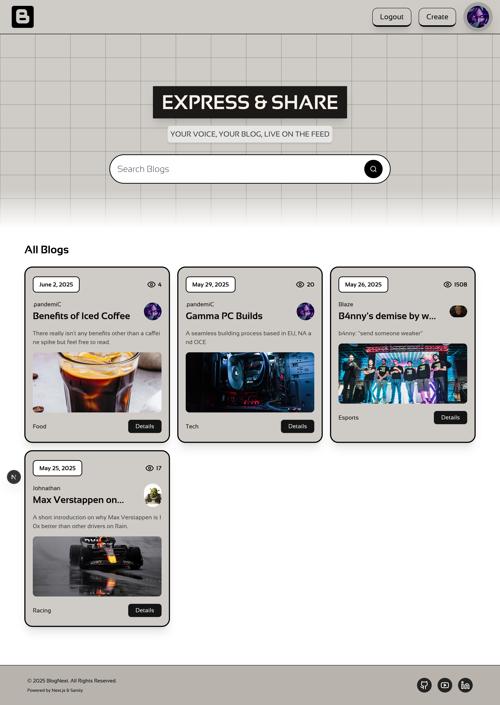
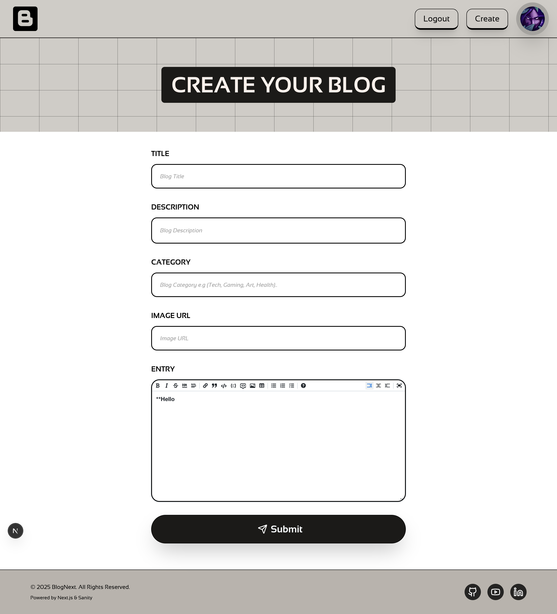
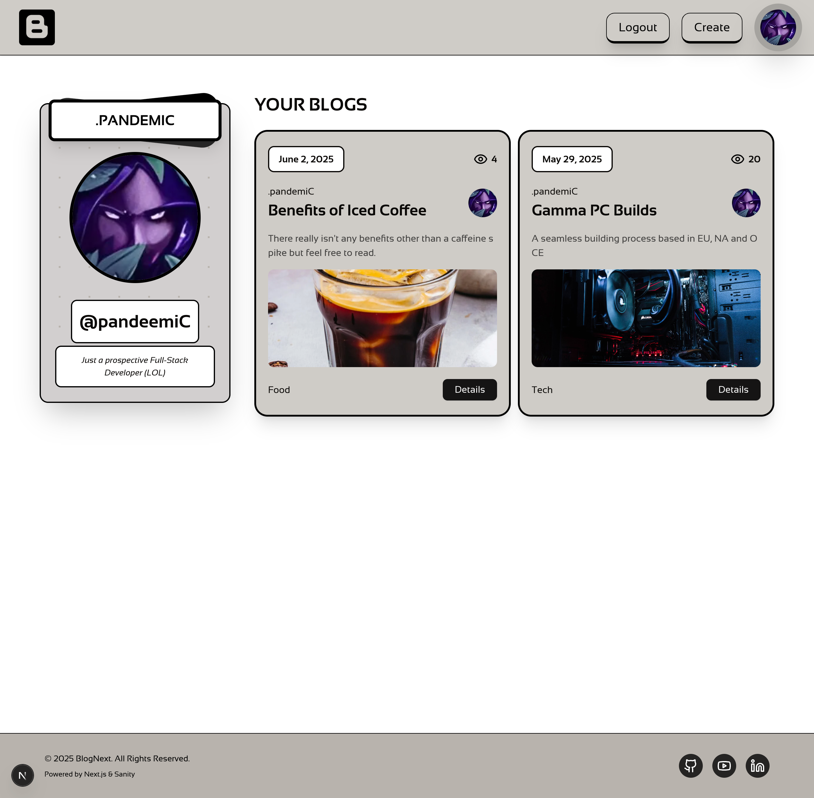
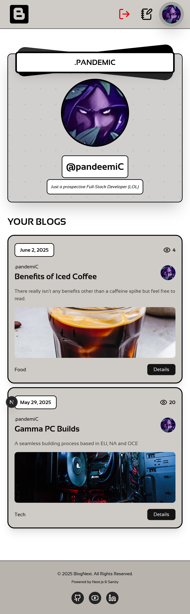
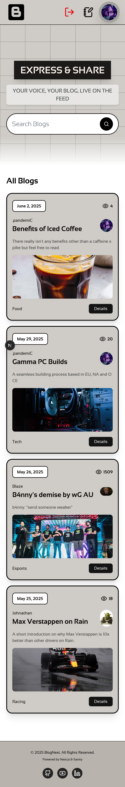

# BlogNext - A Blogging Platform Project

BlogNext, a project that's a full-stack blogging application built to explore modern web development practices with Next.js and Sanity.io.

## Project Overview

BlogNext is designed as a platform for users to read, search, and (for authenticated users) eventually create blog content. The primary goal for the project is to get a hands on learning experience with common Next.js, CMS anderror monitoring practices.

## Core Features

- **Blog Post Display:** Renders blog posts fetched from a headless CMS.
- **Content Search:** Users can search for blog posts by title, category, author, and content description, which the search functionality is case-insensitive.
- **User Authentication:** Implements GitHub OAuth for user login via NextAuth.js.
- **Author Integration:** Associates blog posts with authors, displaying author information,avatars and their descriptions.
- **Markdown Support:** Blog content is intended to be written in Markdown and is styled using Tailwind CSS Typography for a clean reading experience.
- **Responsive Design:** Styled with Tailwind CSS for adaptability across different screen sizes.
- **Experimental Next.js Features:** The project is configured to use Next.js 15 (Canary) with Turbopack and has support for experimental Partial Prerendering (PPR).
- **Error Tracking:** Utilizes Sentry.io for real-time error reporting and performance monitoring.

---

## Screenshots 📷

Click here to view screenshots

# Fully Responsive

## Technology Stack

The project leverages the following technologies:

- **Framework:** Next.js (v15 Canary with Turbopack and PPR enabled)
- **Language:** TypeScript
- **Styling:**
  - Tailwind CSS (v4)
  - Shadcn UI (for core UI components like Avatar, AlertDialog)
  - Lucide React (for SVG icons)
- **Headless CMS:** Sanity.io (v3)
  - GROQ for data querying
  - `sanity-plugin-markdown` for Markdown rich text editing in the Studio
- **Authentication:** NextAuth.js with GitHub Provider
- **Markdown Processing:**
  - `markdown-it` for converting Markdown to HTML
  - `@tailwindcss/typography` for styling rendered Markdown content
- **Error Tracking & Performance Monitoring:** Sentry.io

---

## Live Application

- **Deployed Version:** []

---

## Future Enhancements

- Implementation of Dark Mode and toggles.
- Editing for authorized users.
- Set of settings for the user profiles. (Themes?)
- A commenting system on published blogs by authorized users.

---

This project was entirely for learning purposes, if you have any feedback feel free to reach me.
